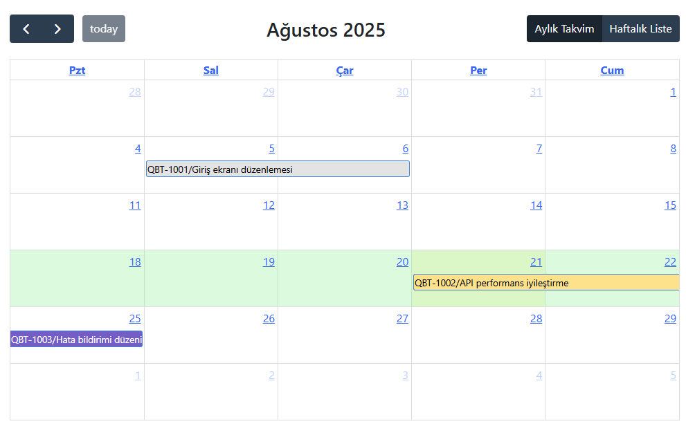

[](LICENSE)


## WorkPlanCalender (ASP.NET MVC 5)

Kurumsal verilerden arındırılmış demo sürüm. `DemoMode` açıkken uygulama veritabanına bağlanmadan örnek kullanıcı ve görevlerle çalışır.

### Özellikler
- FullCalendar ile görev planlama (sürükle-bırak, resize)
- `DemoMode` ile mock kullanıcı ve görev verileri
- Yapılandırılabilir bilet bağlantısı (`TicketBaseUrl`)

### Hızlı Başlangıç
1) Visual Studio ile `CalenderDemo2.sln` dosyasını açın.
2) Başlangıç projesi olarak `CalenderDemo2` seçin ve F5 ile çalıştırın.

### Demo Modu
`CalenderDemo2/Web.config` içinde:
```xml
<appSettings>
  <add key="DemoMode" value="true" />
  <add key="TicketBaseUrl" value="https://example.com/qbt/Ticket/Browse/QBT-" />
</appSettings>
```
- `DemoMode=true`: Kullanıcılar ve görevler bellek içinde üretilir; DB yok.
- `DemoMode=false`: Entity Framework ile gerçek DB’ye bağlanır (kendi bağlantılarınızı tanımlayın).

### Bu projeyi bilgisayarınıza klonlama
```bash
# (repo adresinizi değiştirin)
git clone https://github.com/<kullanici-adi>/<repo-adi>.git
cd <repo-adi>
# Visual Studio ile .sln dosyasını açın ve F5 ile çalıştırın
```

### Arayüz Görünümü
Aşağıdaki görselleri `docs/` klasörüne ekleyin; README otomatik gösterir.




### Notlar
- `.gitignore` takip dışı: `bin/`, `obj/`, `*.user`, publish profilleri vb.
- Demo verileri uygulama yeniden başlatıldığında sıfırlanır (in-memory).
